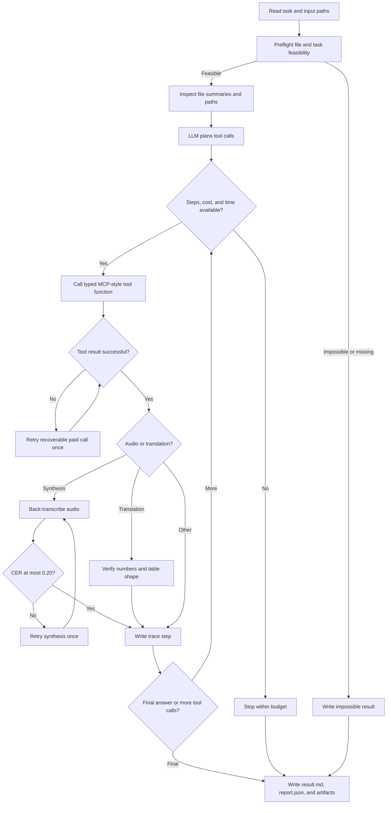

# Agent flow

```mermaid
flowchart TD
    START["Read task and input paths"] --> PREFLIGHT["Preflight file and task feasibility"]
    PREFLIGHT -->|Impossible or missing| FAIL["Write impossible result"]
    PREFLIGHT -->|Feasible| INVENTORY["Inspect file summaries and paths"]
    INVENTORY --> LLM["LLM plans tool calls"]
    LLM --> GUARD{"Steps, cost, and time available?"}
    GUARD -->|No| STOP["Stop within budget"]
    GUARD -->|Yes| CALL["Call typed MCP-style tool function"]
    CALL --> RESULT{"Tool result successful?"}
    RESULT -->|No| RETRY["Retry recoverable paid call once"]
    RETRY --> RESULT
    RESULT -->|Yes| VERIFY{"Audio or translation?"}
    VERIFY -->|Translation| TV["Verify numbers and table shape"]
    VERIFY -->|Synthesis| AV["Back-transcribe audio"]
    AV --> CER{"CER at most 0.20?"}
    CER -->|No| RETRY_AUDIO["Retry synthesis once"]
    RETRY_AUDIO --> AV
    CER -->|Yes| TRACE["Write trace step"]
    TV --> TRACE
    VERIFY -->|Other| TRACE
    TRACE --> LLM_DONE{"Final answer or more tool calls?"}
    LLM_DONE -->|More| GUARD
    LLM_DONE -->|Final| OUTPUT["Write result.md, report.json, and artifacts"]
    STOP --> OUTPUT
    FAIL --> OUTPUT
```

The trace records each LLM and tool step. Generated audio is not considered
complete until back-transcription succeeds or the single retry is exhausted.
